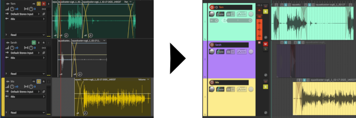

# Audition session to Reaper project converter

This script provides basic conversion between Adobe Audition Session (.sesx) files and Reaper Project (.rpp) files. It was written for use with Python 3.13.



## Supported features
Track:
- Name
- Colour
- Mute / Volume / Pan
- Solo / Record / Monitor
- Volume envelope

Clip:
- Position and length
- Crossfading
- Mute / Volume / Pan
- Volume envelope

## Dependencies

This script depends on the `rpp` package for handling the Reaper Project file structure. It can be installed with pip:

```bash
pip install rpp
```

## Usage

```bash
python convert_sesx_to_rpp.py /path/to/audition_session.sesx
```
The script will generate a new .rpp file in the same directory with the same name.

## Contributing
Session files are structured as XML, so the main effort is finding and matching the correct names between the data field of interest, and the corresponding [chunk name](https://github.com/ReaTeam/Doc/blob/master/State%20Chunk%20Definitions) in the Reaper project file.